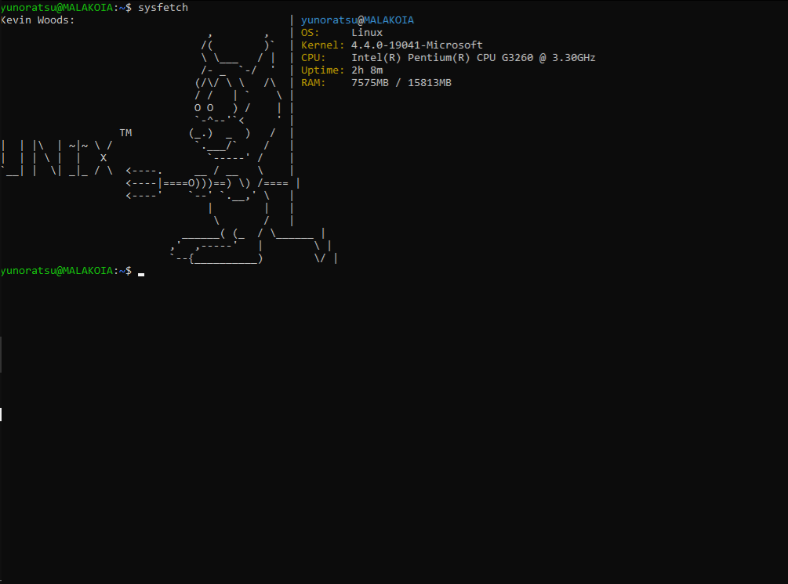

# sysfetch



A high-performance, zero-dependency system fetch tool written in C.

## Features
- **Zero `stdio.h`**: Custom implementation of `printf` for minimal binary size.
- **Raw Syscalls**: Communicates directly with the Linux kernel via `sysinfo` and `/proc`.
- **Embedded Assets**: ASCII art is baked into the binary at compile-time using `xxd`.

### Build from source
```bash
git clone https://github.com/Yunoratsu/sysfetch.git
cd sysfetch
make
sudo make install
